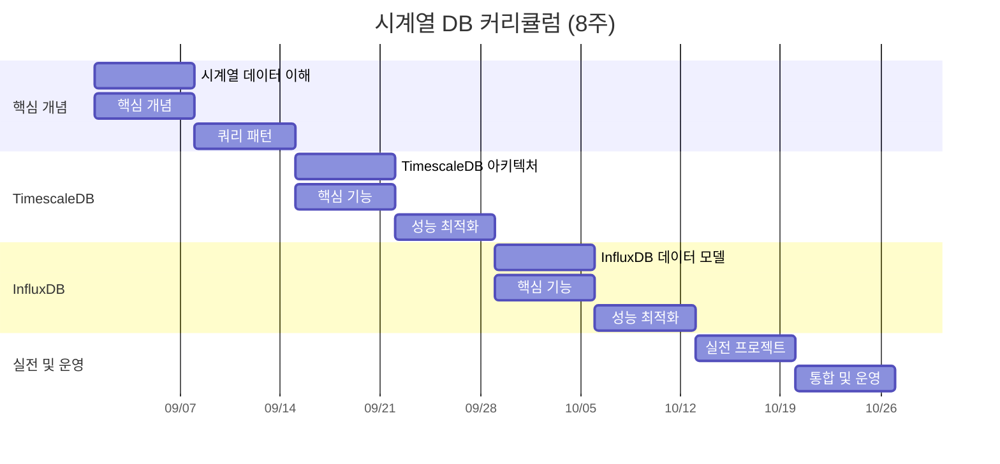

# 시계열 데이터베이스 완전 정복 가이드

> 시계열 데이터의 이해부터 TimescaleDB와 InfluxDB 실무 운영까지 8주 완성 커리큘럼

## 목차

1. [시계열 데이터베이스 핵심 개념 (Week 1-2)](#-week-1-2-시계열-데이터베이스-핵심-개념)
   - 시계열 데이터 특성 이해
   - 핵심 데이터 모델링 개념
   - 주요 쿼리 패턴
2. [TimescaleDB 심화 (Week 3-4)](#-week-3-4-timescaledb-심화)
   - 아키텍처 및 Hypertable
   - 핵심 기능 활용
   - 성능 최적화
3. [InfluxDB 심화 (Week 5-6)](#-week-5-6-influxdb-심화)
   - 데이터 모델 설계
   - 쿼리 언어 마스터
   - 성능 튜닝
4. [실전 프로젝트 (Week 7)](#-week-7-실전-프로젝트)
   - IoT 센서 모니터링 시스템
   - 성능 벤치마크
5. [통합 및 운영 (Week 8)](#-week-8-통합-및-운영)
   - 모니터링 스택 구축
   - 운영 Best Practices
   - 트러블슈팅

---

## 📅 학습 일정표



## 📚 Week 1-2: 시계열 데이터베이스 핵심 개념

### 1.1 시계열 데이터 이해

- **시계열 데이터 특성**
- Append-only 패턴
- 시간 순서 의존성
- 높은 쓰기 처리량, 낮은 업데이트 빈도
- 최근 데이터 조회 빈도 높음

### 1.2 핵심 개념 (모든 시계열 DB 공통)

- **Data Model**

  > 시계열 데이터는 기본적으로 “언제, 무엇을, 어떤 값으로” 측정했는지를 저장합니다.
  >

    ```sql
    -- 일반 RDBMS 방식 (비효율적)
    CREATE TABLE sensor_data (
        id SERIAL PRIMARY KEY,
        device_name VARCHAR(100),
        location VARCHAR(100),
        sensor_type VARCHAR(50),
        temperature FLOAT,
        humidity FLOAT,
        recorded_at TIMESTAMP
    );
    ```
    
    ```bash
    # 시계열 DB 방식 (효율적)
    temperature,device=sensor1,location=seoul value=23.5 1609459200
    humidity,device=sensor1,location=seoul value=45.2 1609459200
    ```

  시계열 데이터베이스는 이러한 시간에 따른 측정값을 효율적으로 저장하고 쿼리하기 위해 최적화되어 있습니다. 일반 RDBMS와 달리 시계열 DB는 시간을 기본 인덱스로 사용하며, 데이터 압축과 보관 정책을 통해 스토리지를 효율적으로 관리합니다. 또한 시계열 데이터에 특화된 쿼리 언어와 집계 함수를 제공하여 데이터 분석을 용이하게 합니다.

- Metric/Measurement (측정 대상)

    ```yaml
    # 예제: 스마트홈 센서 데이터
    """
    Measurement = "무엇을 측정하는가?"
    - temperature (온도)
    - humidity (습도)  
    - power_usage (전력사용량)
    - air_quality (공기질)
    """
    ```
    
    ```bash
    # InfluxDB Line Protocol
    temperature,room=living value=22.5 1609459200000000000
    power_usage,appliance=aircon watts=850 1609459200000000000
    ```
    
    ```sql
    -- TimescaleDB에서는 테이블명이 Measurement
    CREATE TABLE temperature (
        time TIMESTAMPTZ NOT NULL,
        room TEXT,
        value DOUBLE PRECISION
    );
    ```

- Timestamp (시간 정보)

  **시계열 데이터베이스에서 Timestamp의 중요성**

    ```bash
    # Timestamp (시간 정보) 이해하기
    # 모든 시계열 데이터의 핵심 요소
    
    # Unix timestamp (epoch) 형식 - 밀리초/나노초 단위로 저장
    # 1609459200000000000 = 2021-01-01 00:00:00 UTC (나노초)
    # 1609459200000 = 2021-01-01 00:00:00 UTC (밀리초)
    
    # InfluxDB - 나노초 단위로 저장
    temperature,room=living value=22.5 1609459200000000000
                                       ^^^^^^^^^^^^^^^^^^^ 타임스탬프
    
    # 타임스탬프 정밀도 (Precision) 선택
    # - 초 (s): 1609459200
    # - 밀리초 (ms): 1609459200000
    # - 마이크로초 (us): 1609459200000000  
    # - 나노초 (ns): 1609459200000000000
    
    # 필요한 정밀도만 선택 (더 높은 정밀도 = 더 많은 스토리지)
    ```
    
    ```sql
    -- TimescaleDB - PostgreSQL TIMESTAMP WITH TIME ZONE 사용
    CREATE TABLE sensor_data (
        time TIMESTAMPTZ NOT NULL,  -- 타임스탬프 컬럼
        sensor_id TEXT,
        value FLOAT
    );
    ```

  **타임스탬프 관련 고려사항:**

    - 시간대(Timezone) 처리 전략 (UTC 표준화 권장)
    - 정밀도와 스토리지 사용량 간의 균형
    - 이벤트 도착 순서 vs 실제 발생 순서 관리
    - 지연 도착 데이터(Late-arriving data) 처리 전략
- Tags/Labels (메타데이터, 인덱싱용)

    ```bash
    # Tags/Labels = WHERE 절에 자주 사용 (인덱싱됨)
    # Fields/Values = 실제 측정값 (인덱싱 안됨)
    
    # 잘못된 설계
    temperature,value=23.5 room=living,sensor_id=A001 1609459200
    # ❌ value를 tag로 사용 -> 카디널리티 폭발
    
    # 올바른 설계  
    temperature,room=living,sensor_id=A001 value=23.5,humidity=45 1609459200
    # ✅ 필터링할 메타데이터는 tag, 측정값은 field 
    ```

  **연습 문제:**

    ```yaml
    # 다음 데이터를 시계열 모델로 설계해보세요
    """
    주식 거래 데이터:
    - 종목코드: AAPL
    - 거래소: NASDAQ  
    - 현재가: 150.25
    - 거래량: 1000000
    - 시간: 2024-01-01 09:30:00
    """
    ```
    
    ```bash
    # 답안:
    # Measurement: stock_price
    # Tags: symbol=AAPL, exchange=NASDAQ
    # Fields: price=150.25, volume=1000000
    # Timestamp: 1704096600000000000
    
    stock_price,symbol=AAPL,exchange=NASDAQ price=150.25,volume=1000000 1704096600000000000
    ```


- Fields/Values (실제 측정값)

  **시계열 데이터베이스에서 Fields/Values 이해하기**

    ```bash
    # Fields/Values = 실제 측정값 (기본적으로 인덱싱 안됨)
    # InfluxDB 예제
    cpu_usage,host=server01,region=us-west value=0.64 1609459200000000000
                                            ^^^^^^^^^^^ 이 부분이 Field
    
    # 주요 특징:
    # 1. 실제 측정된 값을 저장
    # 2. 다양한 데이터 타입 지원 (float, integer, string, boolean)
    # 3. 일반적으로 인덱싱되지 않음 (빠른 삽입 최적화)
    # 4. 여러 Field를 동시에 저장 가능
    ```
    
    ```sql
    -- TimescaleDB 예제
    CREATE TABLE cpu (
        time TIMESTAMPTZ NOT NULL,
        host TEXT,
        region TEXT,
        usage DOUBLE PRECISION,  -- 이 부분이 Field/Value
        temperature DOUBLE PRECISION  -- 이 부분이 Field/Value
    );
    ```

  **Fields/Values 설계 고려사항:**

    - 여러 개의 관련 측정값을 단일 레코드에 저장 (온도+습도+압력)
    - Field 타입에 따른 성능 차이 이해 (float vs string)
    - 자주 필터링이 필요한 값은 Field보다 Tag로 설계
    - null 값 처리 전략 수립 (누락된 측정값)

- **저장소(Storage) 전략**
    - **데이터 분할(Partitioning)**
    - 시간 기반 데이터 분할(Time-based Partitioning)
    - 관리 가능한 청크(Chunk) 크기 설정
    - 단계별 저장소 구성(Hot/Warm/Cold Storage)

- Time-based Partitioning

  **1. Time-based Partitioning 실습**

  **왜 파티셔닝이 중요한가?**

    ```sql
    -- TimescaleDB 자동 파티셔닝
    CREATE TABLE metrics (
        time TIMESTAMPTZ NOT NULL,
        device_id TEXT,
        value DOUBLE PRECISION
    );
    
    -- 7일 단위로 자동 파티션 생성
    SELECT create_hypertable('metrics', 'time', 
                             chunk_time_interval => INTERVAL '7 days');
    
    -- 파티션(chunk) 확인
    SELECT * FROM timescaledb_information.chunks 
    WHERE hypertable_name = 'metrics';
    
    -- 결과: 
    -- chunk_name           | range_start        | range_end
    -- _hyper_1_1_chunk    | 2024-01-01        | 2024-01-08
    -- _hyper_1_2_chunk    | 2024-01-08        | 2024-01-15
    ```

- 데이터 압축 기법 (Delta encoding, Gorilla compression)

  **시계열 데이터 압축 기법 이해하기**

    ```sql
    -- 시계열 데이터 압축 예제
    -- TimescaleDB 압축 설정
    
    -- 테이블 생성 및 하이퍼테이블 설정
    CREATE TABLE sensor_data (
      time TIMESTAMPTZ NOT NULL,
      sensor_id TEXT,
      value FLOAT
    );
    
    SELECT create_hypertable('sensor_data', 'time');
    
    -- 압축 정책 설정
    ALTER TABLE sensor_data SET (
      timescaledb.compress,
      timescaledb.compress_segmentby = 'sensor_id'
    );
    
    -- 7일 이상 된 데이터 자동 압축 정책
    SELECT add_compression_policy('sensor_data', INTERVAL '7 days');
    ```

- 데이터 보존 정책 (Data Retention Policy)

  **시계열 DB에서 데이터 보존 정책 설정하기**

    ```sql
    -- TimescaleDB 데이터 보존 정책
    -- 90일 이상 데이터 자동 삭제
    SELECT add_retention_policy('metrics', INTERVAL '90 days');
    
    -- 보존 정책 확인
    SELECT * FROM timescaledb_information.policies 
    WHERE hypertable_name = 'metrics';
    ```
    
    ```sql
    -- InfluxDB 데이터 보존 정책 (1.x)
    CREATE RETENTION POLICY "90days" ON "database_name"
      DURATION 90d REPLICATION 1 DEFAULT;
    ```
    
    ```bash
    # InfluxDB 2.x 버킷 생성 시 보존 기간 설정
    influx bucket create --name metrics --retention 2160h
    ```

  **데이터 보존 정책 고려사항:**

    - 규제 및 컴플라이언스 요구사항 (금융 데이터 등)
    - 스토리지 비용과 데이터 가치 간 균형
    - 다운샘플링된 데이터만 장기 보존
    - Cold Storage로 이동 전략 (S3, GCS 등)
- 다운샘플링 및 집계 전략 (Downsampling/Rollup)

  **시계열 데이터의 집계 및 요약을 위한 다운샘플링 기법**

    ```sql
    -- InfluxDB 다운샘플링 예제 (Continuous Query - 1.x)
    CREATE CONTINUOUS QUERY "cq_30m" ON "database_name"
    BEGIN
      SELECT mean("value") AS "mean_value"
      INTO "downsampled_measurement"
      FROM "original_measurement"
      GROUP BY time(30m), *
    END
    ```
    
    ```flux
    // InfluxDB 2.x Flux 다운샘플링
    from(bucket: "source_bucket")
      |> range(start: -1d)
      |> filter(fn: (r) => r._measurement == "cpu")
      |> aggregateWindow(every: 1h, fn: mean)
      |> to(bucket: "downsampled_bucket")
    ```
    
    ```sql
    -- TimescaleDB 다운샘플링 (Continuous Aggregates)
    CREATE MATERIALIZED VIEW metrics_hourly
    WITH (timescaledb.continuous) AS
    SELECT
      time_bucket('1 hour', time) AS hour,
      device_id,
      AVG(value) AS avg_value,
      MAX(value) AS max_value,
      MIN(value) AS min_value
    FROM metrics
    GROUP BY hour, device_id;
    ```

  **다운샘플링 고려사항:**

    - 집계 함수 선택 (avg, min, max, sum, count, percentile 등)
    - 시간 버킷 크기 결정 (5분, 1시간, 1일)
    - 정밀도와 스토리지 사용량 간의 트레이드오프
    - 원본 데이터 삭제 vs 보관 정책

### 1.3 주요 쿼리 패턴

- 시간 범위 쿼리 (Time Range Query)

  **시계열 데이터베이스의 Time Range 쿼리 이해하기**

    ```sql
    -- TimescaleDB에서 시간 범위 쿼리
    SELECT time, sensor_id, value
    FROM sensor_data
    WHERE time >= '2024-01-01 00:00:00' AND time < '2024-01-02 00:00:00'
    ORDER BY time;
    
    -- InfluxDB에서 시간 범위 쿼리 (InfluxQL)
    SELECT "value" FROM "sensor_data" 
    WHERE time >= '2024-01-01T00:00:00Z' AND time < '2024-01-02T00:00:00Z'
    ORDER BY time;
    ```
    
    ```flux
    // InfluxDB Flux 시간 범위 쿼리
    from(bucket: "metrics")
      |> range(start: 2024-01-01T00:00:00Z, stop: 2024-01-02T00:00:00Z)
      |> filter(fn: (r) => r._measurement == "sensor_data")
      |> yield()
    ```

  **Time Range 쿼리 최적화 기법:**

    - 시간 필터를 WHERE 절의 첫 번째 조건으로 사용
    - 날짜 함수 사용 최소화 (인덱스 활용 저하)
    - ISO 8601 형식 사용 (timezone 혼란 방지)
    - 자주 사용하는 시간 범위는 인덱스 설계에 반영
- 집계 쿼리 (Aggregation: avg, sum, max, min, count)

  **시계열 데이터베이스에서 집계 쿼리 패턴 이해하기**

    ```sql
    -- TimescaleDB 집계 쿼리
    SELECT 
      time_bucket('1 hour', time) AS hour,
      AVG(value) AS avg_value,
      SUM(value) AS sum_value,
      MAX(value) AS max_value,
      MIN(value) AS min_value,
      COUNT(*) AS sample_count
    FROM sensor_data
    WHERE time >= '2024-01-01' AND time < '2024-01-02'
    GROUP BY hour
    ORDER BY hour;
    
    -- InfluxDB 집계 쿼리 (InfluxQL)
    SELECT 
      MEAN(value) AS avg_value,
      SUM(value) AS sum_value,
      MAX(value) AS max_value,
      MIN(value) AS min_value,
      COUNT(value) AS sample_count
    FROM "sensor_data"
    WHERE time >= '2024-01-01T00:00:00Z' AND time < '2024-01-02T00:00:00Z'
    GROUP BY time(1h)
    ORDER BY time;
    ```
    
    ```flux
    // InfluxDB Flux 집계 쿼리
    from(bucket: "metrics")
      |> range(start: 2024-01-01T00:00:00Z, stop: 2024-01-02T00:00:00Z)
      |> filter(fn: (r) => r._measurement == "sensor_data")
      |> aggregateWindow(every: 1h, fn: mean, createEmpty: true)
      |> yield(name: "mean")
    ```

  **집계 쿼리 최적화 팁:**

    - 미리 계산된 집계(Continuous Aggregates) 활용
    - GROUP BY 절에서 적절한 시간 단위 선택
    - 필요한 집계 함수만 사용 (불필요한 계산 제거)
    - 시간 범위 필터를 항상 먼저 적용
- 시간 버킷 집계 (Time Bucketing: 5분, 1시간 단위)

  **시계열 데이터에서 시간 단위 집계(Time Bucketing) 이해하기**

    ```sql
    -- TimescaleDB의 time_bucket 함수
    SELECT 
      time_bucket('5 minutes', time) AS five_min_bucket,
      AVG(value) AS avg_value
    FROM sensor_data
    WHERE time >= '2024-01-01' AND time < '2024-01-02'
    GROUP BY five_min_bucket
    ORDER BY five_min_bucket;
    
    -- 다양한 시간 단위 적용
    SELECT 
      time_bucket('1 hour', time) AS hourly_bucket,
      device_id,
      AVG(value) AS avg_value
    FROM metrics
    WHERE time >= NOW() - INTERVAL '1 day'
    GROUP BY hourly_bucket, device_id
    ORDER BY hourly_bucket, device_id;
    
    -- InfluxDB 시간 단위 집계 (InfluxQL)
    SELECT MEAN("value")
    FROM "sensor_data"
    WHERE time >= '2024-01-01T00:00:00Z' AND time < '2024-01-02T00:00:00Z'
    GROUP BY time(5m), "device_id"
    ORDER BY time;
    ```
    
    ```flux
    // InfluxDB Flux 시간 단위 집계
    from(bucket: "metrics")
      |> range(start: -1d)
      |> filter(fn: (r) => r._measurement == "sensor_data")
      |> aggregateWindow(every: 5m, fn: mean)
      |> yield()
    ```

  **시간 버킷팅 고려사항:**

    - 적절한 시간 단위 선택 (사용 사례에 따라 다름)
    - 시간대(timezone) 일관성 유지
    - Gap filling 전략 (NULL 값 처리 방식)
    - 버킷 경계 처리 (포함/미포함)
- 변화율 및 미분 계산 (Rate/Derivative)

  **시계열 데이터에서 변화율과 미분값 계산하기**

    ```sql
    -- TimescaleDB에서 Rate 계산 (변화량/시간 간격)
    SELECT 
      time,
      sensor_id,
      value,
      (value - LAG(value, 1) OVER (PARTITION BY sensor_id ORDER BY time)) / 
      EXTRACT(EPOCH FROM (time - LAG(time, 1) OVER (PARTITION BY sensor_id ORDER BY time))) AS rate_per_second
    FROM sensor_data
    WHERE time >= NOW() - INTERVAL '1 hour'
    ORDER BY sensor_id, time;
    
    -- TimescaleDB Derivative 함수 (1.7+)
    SELECT 
      time_bucket('5 minutes', time) AS bucket,
      sensor_id,
      AVG(derivative(value, time)) AS avg_derivative
    FROM sensor_data
    WHERE time >= NOW() - INTERVAL '1 day'
    GROUP BY bucket, sensor_id;
    ```
    
    ```sql
    -- InfluxDB에서 Derivative 계산 (InfluxQL)
    SELECT derivative("value", 1s) AS "rate_per_second"
    FROM "sensor_data"
    WHERE time >= now() - 1h
    GROUP BY "sensor_id";
    
    -- 비음수 Derivative (카운터 리셋 처리)
    SELECT non_negative_derivative("counter_value", 1s) AS "rate"
    FROM "metrics"
    WHERE time >= now() - 1h;
    ```
    
    ```flux
    // InfluxDB Flux에서 Derivative 계산
    from(bucket: "metrics")
      |> range(start: -1h)
      |> filter(fn: (r) => r._measurement == "sensor_data")
      |> derivative(unit: 1s, nonNegative: true)
      |> yield()
    ```

  **Rate/Derivative 계산 활용 사례:**

    - CPU 사용률 변화량 분석
    - 네트워크 트래픽 증감률 모니터링
    - 카운터 기반 메트릭의 초당 변화량
    - 이상 징후 탐지 (급격한 변화 감지)

- 이동 평균 (Moving Average)

  **시계열 데이터에서 이동평균을 통한 노이즈 제거 및 트렌드 분석**

    ```sql
    -- TimescaleDB 단순 이동평균 (Simple Moving Average)
    SELECT 
      time,
      sensor_id,
      value,
      AVG(value) OVER (
        PARTITION BY sensor_id 
        ORDER BY time 
        ROWS BETWEEN 4 PRECEDING AND CURRENT ROW
      ) AS sma_5_points
    FROM sensor_data
    WHERE time >= NOW() - INTERVAL '1 day'
    ORDER BY sensor_id, time;
    
    -- 시간 기반 이동평균 (30분 윈도우)
    SELECT 
      time_bucket('5 minutes', time) AS bucket,
      sensor_id,
      AVG(avg_value) OVER (
        PARTITION BY sensor_id 
        ORDER BY time_bucket('5 minutes', time) 
        RANGE BETWEEN INTERVAL '30 minutes' PRECEDING AND CURRENT ROW
      ) AS moving_avg_30min
    FROM (
      SELECT 
        time_bucket('5 minutes', time) AS bucket,
        sensor_id,
        AVG(value) AS avg_value
      FROM sensor_data
      WHERE time >= NOW() - INTERVAL '1 day'
      GROUP BY bucket, sensor_id
    ) subquery
    ORDER BY sensor_id, bucket;
    ```
    
    ```sql
    -- InfluxDB 이동평균 (InfluxQL)
    SELECT moving_average("value", 5) AS "ma_5"
    FROM "sensor_data"
    WHERE time >= now() - 6h
    GROUP BY "sensor_id", time(1m);
    
    -- 지수 이동평균 (Exponential Moving Average)
    SELECT exponential_moving_average("value", 5) AS "ema_5"
    FROM "sensor_data"
    WHERE time >= now() - 6h;
    ```
    
    ```flux
    // InfluxDB Flux 이동평균
    from(bucket: "metrics")
      |> range(start: -6h)
      |> filter(fn: (r) => r._measurement == "sensor_data")
      |> movingAverage(n: 5)  // 5포인트 이동평균
      |> yield()
    
    // 시간 기반 이동평균
    from(bucket: "metrics")
      |> range(start: -6h)
      |> filter(fn: (r) => r._measurement == "sensor_data")
      |> timedMovingAverage(every: 5m, period: 30m)
      |> yield()
    ```

  **Moving Average 활용 사례:**

    - 센서 데이터 노이즈 제거
    - 트렌드 분석 및 예측
    - 이상치 탐지 (실제값 vs 이동평균 비교)
    - 시계열 데이터 평활화

- 결측값 처리 전략 (Fill strategies)

  **시계열 데이터의 결측값 처리 전략**

    ```sql
    -- TimescaleDB Gap Filling 전략
    
    -- 1. 선형 보간 (Linear Interpolation)
    SELECT 
      time_bucket_gapfill('5 minutes', time) AS bucket,
      sensor_id,
      interpolate(AVG(value)) AS interpolated_value
    FROM sensor_data
    WHERE time >= NOW() - INTERVAL '1 day'
      AND sensor_id = 'sensor_001'
    GROUP BY bucket, sensor_id
    ORDER BY bucket;
    
    -- 2. 이전 값으로 채우기 (Forward Fill)
    SELECT 
      time_bucket_gapfill('5 minutes', time) AS bucket,
      sensor_id,
      locf(AVG(value)) AS forward_filled_value
    FROM sensor_data
    WHERE time >= NOW() - INTERVAL '1 day'
    GROUP BY bucket, sensor_id;
    
    -- 3. 특정 값으로 채우기
    SELECT 
      time_bucket_gapfill('5 minutes', time, '2024-01-01', '2024-01-02') AS bucket,
      sensor_id,
      COALESCE(AVG(value), 0) AS filled_value
    FROM sensor_data
    WHERE time >= '2024-01-01' AND time < '2024-01-02'
    GROUP BY bucket, sensor_id;
    ```
    
    ```sql
    -- InfluxDB Fill 전략 (InfluxQL)
    
    -- 선형 보간
    SELECT mean("value")
    FROM "sensor_data"
    WHERE time >= now() - 1d
    GROUP BY time(5m) fill(linear);
    
    -- 이전 값으로 채우기
    SELECT mean("value")
    FROM "sensor_data"
    WHERE time >= now() - 1d
    GROUP BY time(5m) fill(previous);
    
    -- 특정 값으로 채우기
    SELECT mean("value")
    FROM "sensor_data"
    WHERE time >= now() - 1d
    GROUP BY time(5m) fill(0);
    
    -- null 값 그대로 유지
    SELECT mean("value")
    FROM "sensor_data"
    WHERE time >= now() - 1d
    GROUP BY time(5m) fill(null);
    ```
    
    ```flux
    // InfluxDB Flux Fill 전략
    
    // 선형 보간
    from(bucket: "metrics")
      |> range(start: -1d)
      |> filter(fn: (r) => r._measurement == "sensor_data")
      |> aggregateWindow(every: 5m, fn: mean)
      |> fill(usePrevious: false)  // 선형 보간
      |> yield()
    
    // 이전 값으로 채우기
    from(bucket: "metrics")
      |> range(start: -1d)
      |> filter(fn: (r) => r._measurement == "sensor_data")
      |> aggregateWindow(every: 5m, fn: mean)
      |> fill(usePrevious: true)
      |> yield()
    
    // 특정 값으로 채우기
    from(bucket: "metrics")
      |> range(start: -1d)
      |> filter(fn: (r) => r._measurement == "sensor_data")
      |> aggregateWindow(every: 5m, fn: mean)
      |> fill(value: 0.0)
      |> yield()
    ```

  **Fill Strategy 선택 가이드:**

    - **선형 보간 (Linear)**: 연속적인 데이터, 짧은 누락 구간
    - **이전값 채우기 (Previous/LOCF)**: 상태 기반 데이터, 변화가 적은 데이터
    - **0 또는 기본값**: 카운터 데이터, 누적 메트릭
    - **Null 유지**: 분석에서 누락 데이터를 명시적으로 처리해야 하는 경우
    - **평균값**: 정상 범위 내의 대표값 사용

## 🔧 Week 3-4: TimescaleDB 심화

### 3.1 TimescaleDB 아키텍처

- Hypertable 생성 및 관리
- Chunk 기반 자동 파티셔닝
- PostgreSQL 확장 아키텍처 이해

### 3.2 핵심 기능

- **Continuous Aggregates**
- Materialized View 자동 업데이트
- Refresh policy 설정
- Real-time aggregation
- **Compression**
- Segment-by 컬럼 선택
- Compression policy 설정
- 압축률 vs 쿼리 성능 트레이드오프
- **Data Retention**
- Retention policy 자동화
- Drop chunks 전략
- Tiered storage 구성

### 3.3 성능 최적화

- Index 전략 (B-tree vs BRIN)
- Chunk 크기 튜닝
- Parallel processing 활용
- Query planning 분석

## 📊 Week 5-6: InfluxDB 심화

### 5.1 InfluxDB 데이터 모델

- Line Protocol 마스터
- Measurement 설계 원칙
- Tag vs Field 선택 기준
- Timestamp precision 설정

### 5.2 핵심 기능

- **Series & Cardinality**
- Series = Measurement + Tag Set
- Cardinality 관리 전략
- Series 폭발 방지
- **Query Languages**
- InfluxQL 문법 및 활용
- Flux 함수형 프로그래밍
- Query 최적화 기법
- **Retention & Downsampling**
- Retention Policy 설계
- Continuous Query 작성
- Task 기반 자동화 (InfluxDB 2.x)

### 5.3 성능 최적화

- Batch writing 전략
- Shard duration 최적화
- Cache 설정 튜닝
- WAL 및 TSM 이해

## 🚀 Week 7: 실전 프로젝트

### 7.1 공통 프로젝트: IoT 센서 모니터링

**요구사항**

- 초당 100K points 수집
- 5분/1시간/1일 단위 집계
- 실시간 이상치 탐지
- 30일 데이터 보관

**TimescaleDB 구현**

- Hypertable 설계
- Continuous Aggregate 구성
- PostgreSQL 트리거 활용
- pg_cron 스케줄링

**InfluxDB 구현**

- Bucket 구조 설계
- Flux task 작성
- Kapacitor 연동
- Alert 설정

### 7.2 성능 벤치마크

- Write Performance (points/sec)
- Query Latency (p50, p95, p99)
- Storage Efficiency (압축률)
- Resource Usage (CPU, Memory, Disk I/O)

## 🔄 Week 8: 통합 및 운영

### 8.1 모니터링 스택

- **Data Collection**
- Telegraf 설정
- Custom collector 개발
- Kafka integration
- **Visualization**
- Grafana 대시보드 구축
- Alert rule 설정
- Custom panel 개발

### 8.2 운영 Best Practices

- **Backup & Recovery**
- Incremental backup 전략
- Point-in-time recovery
- Disaster recovery plan
- **High Availability**
- Replication 구성
- Load balancing
- Failover 자동화
- **Security**
- Authentication/Authorization
- SSL/TLS 설정
- Audit logging
- Data encryption

### 8.3 트러블슈팅

- 성능 저하 진단
- Memory 사용량 최적화
- Disk space 관리
- Query timeout 해결

## 📝 학습 퀴즈 및 과제

### Week 1-2: 시계열 데이터베이스 핵심 개념

- 시계열 데이터 이해 퀴즈
    - 시계열 데이터의 핵심 특성 3가지를 설명하시오.
    - 시계열 데이터베이스가 일반 RDBMS와 다른 점은 무엇인가?
    - 시계열 데이터 모델링 시 고려해야 할 핵심 요소는?
- 핵심 개념 과제

  **실습 과제:** 다음 데이터셋을 시계열 모델로 설계하고 TimescaleDB와 InfluxDB에 각각 구현하시오.

    ```yaml
    # 스마트 공장 센서 데이터:
    # - 공장 ID, 라인 번호, 센서 타입
    # - 온도, 습도, 진동, 소음 레벨
    # - 5초 간격 측정, 하루 최대 1000만 데이터 포인트
    ```

- 쿼리 패턴 연습

  **쿼리 작성:** 다음 질문에 대한 쿼리를 TimescaleDB SQL과 InfluxQL로 각각 작성하시오.

    - 지난 24시간 동안 10분 단위로 평균 온도 조회
    - 특정 센서의 최대값이 임계치를 초과한 시간대 탐지
    - 센서별 이동평균(moving average) 계산

### Week 3-4: TimescaleDB 심화

- TimescaleDB 아키텍처 퀴즈
    - Hypertable과 일반 PostgreSQL 테이블의 차이점은?
    - Chunk 크기가 성능에 미치는 영향을 설명하시오.
    - 다차원 파티셔닝의 장단점은?
- 핵심 기능 실습

  **실습 과제:** 주식 시세 데이터에 대해 다음을 구현하시오.

    - 1분/5분/1시간 단위 OHLCV 연속 집계 설정
    - 3개월 이상 데이터 압축 정책 구현
    - 1년 이상 데이터 다운샘플링 및 삭제 자동화
- 성능 최적화 과제

  **튜닝 과제:** 다음 쿼리의 실행 계획을 분석하고 성능을 최적화하시오.

    ```sql
    SELECT 
      time_bucket('1 hour', time) AS hour,
      device_id,
      AVG(temperature), 
      MAX(temperature)
    FROM sensor_data
    WHERE 
      time > NOW() - INTERVAL '1 month' AND
      location_id IN (SELECT id FROM critical_locations)
    GROUP BY hour, device_id
    ORDER BY hour, device_id;
    ```


### Week 5-6: InfluxDB 심화

- InfluxDB 데이터 모델 퀴즈
    - 고카디널리티 태그가 성능에 미치는 영향과 해결책은?
    - 효율적인 measurement 설계 원칙 3가지는?
    - Field vs Tag 선택이 쿼리 성능에 미치는 영향은?
- 핵심 기능 실습

  **실습 과제:** CPU/메모리/디스크 사용량 모니터링 시스템을 구현하시오.

    - Telegraf를 사용한 데이터 수집 설정
    - Flux를 사용한 이상치 탐지 Task 구현
    - 다중 보관 정책(hot/warm/cold) 설계
- 성능 최적화 과제

  **벤치마크 과제:** 다음 쿼리 패턴에 대해 InfluxDB 성능을 측정하고 최적화하시오.

    ```yaml
    # 벤치마크 쿼리 패턴:
    # 1. 태그 필터링 + 시간 범위 조회
    # 2. 대량 데이터 집계 (GROUP BY time)
    # 3. 정규식 기반 측정값 검색
    # 4. 복잡한 수학 함수 적용 (derivative, moving_average)
    ```


### Week 7-8: 실전 및 운영

- 실전 프로젝트 평가 기준

  **IoT 센서 모니터링 프로젝트 평가:**

    - 데이터 모델 설계 적절성 (20%)
    - 쓰기 성능 및 확장성 (25%)
    - 쿼리 응답 시간 및 효율성 (25%)
    - 시스템 리소스 사용 최적화 (15%)
    - 가용성 및 복구 전략 (15%)
- 운영 시나리오 과제

  **트러블슈팅 시나리오:** 다음 상황에 대한 진단 및 해결 방안을 제시하시오.

    - 갑작스러운 쓰기 성능 저하 발생
    - 특정 시간대 쿼리 타임아웃 증가
    - 디스크 공간 사용량 급증
    - 백업 복구 실패
- 최종 설계 발표

  **최종 과제:** 다음 중 하나의 시나리오를 선택하여 전체 시스템 설계안을 발표하시오.

    - 금융 거래 모니터링 (초당 1만 트랜잭션)
    - 스마트 시티 센서 네트워크 (10만 센서)
    - 대규모 웹 서비스 모니터링 (1,000대 서버)
    - 산업용 IoT 플랫폼 (실시간 이상 감지)

## 📋 학습 체크리스트

### 공통 개념 (Week 1-2)

- [ ]  Time-series 특성 이해
- [ ]  Partitioning 전략 숙지
- [ ]  Compression 기법 이해
- [ ]  Retention policy 설계
- [ ]  Window function 활용
- [ ]  Downsampling 구현

### TimescaleDB (Week 3-4)

- [ ]  Hypertable 생성/관리
- [ ]  Chunk 최적화
- [ ]  Continuous Aggregate 구현
- [ ]  Compression 설정
- [ ]  SQL 기반 분석 쿼리

### InfluxDB (Week 5-6)

- [ ]  Line Protocol 마스터
- [ ]  Tag/Field 설계 원칙
- [ ]  InfluxQL 쿼리 작성
- [ ]  Flux 스크립트 개발
- [ ]  Cardinality 관리

### 실무 역량 (Week 7-8)

- [ ]  대용량 데이터 처리
- [ ]  실시간 파이프라인 구축
- [ ]  모니터링 대시보드 개발
- [ ]  성능 튜닝 경험
- [ ]  운영 자동화 구현

## 🎯 최종 목표

- 시계열 DB 아키텍처 완벽 이해
- TimescaleDB/InfluxDB 모두 Production 운영 가능
- 용도별 적합한 DB 선택 능력
- 성능 최적화 및 트러블슈팅 전문성
- 실시간 데이터 파이프라인 설계/구축 능력

## 💡 실무 Best Practices 및 운영 경험

### 데이터 모델링 Best Practices

#### 1. Tag vs Field 설계 원칙

```yaml
# 올바른 시계열 데이터 모델링
Good Practice:
  - Tags: 필터링/그룹핑에 사용하는 메타데이터 (카디널리티 < 1M)
  - Fields: 실제 측정값, 수치 데이터
  - Measurement: 논리적으로 관련된 데이터를 그룹핑

Bad Practice:
  - 높은 카디널리티 데이터를 Tag로 사용 (사용자 ID, 세션 ID)
  - 자주 변경되는 값을 Tag로 설정
  - 너무 많은 Field를 한 측정에 포함
```

```sql
-- 좋은 예시: 웹 서버 모니터링
-- Measurement: http_request
-- Tags: server_name, endpoint, method, status_code
-- Fields: response_time, request_size, response_size

-- 나쁜 예시
-- Tags에 session_id 포함 (높은 카디널리티)
-- response_time을 Tag로 사용 (연속값)
```

#### 2. 시간 파티셔닝 최적화

```sql
-- TimescaleDB: 적절한 청크 크기 설정
-- 일반적 권장: 7일 ~ 1개월
SELECT create_hypertable('metrics', 'time', 
                         chunk_time_interval => INTERVAL '7 days');

-- 고빈도 데이터의 경우 더 작은 청크 사용
SELECT create_hypertable('high_freq_data', 'time',
                         chunk_time_interval => INTERVAL '1 day');
```

### 성능 최적화 실무 팁

#### 1. 쿼리 성능 최적화

```sql
-- 1. 시간 필터를 항상 첫 번째 조건으로
-- ✅ Good
SELECT * FROM metrics 
WHERE time >= NOW() - INTERVAL '1 hour' 
  AND server_name = 'web-01';

-- ❌ Bad  
SELECT * FROM metrics 
WHERE server_name = 'web-01'
  AND time >= NOW() - INTERVAL '1 hour';

-- 2. 적절한 인덱스 설계
CREATE INDEX CONCURRENTLY idx_metrics_server_time 
ON metrics (server_name, time DESC);

-- 3. LIMIT 사용으로 불필요한 데이터 읽기 방지
SELECT * FROM metrics 
WHERE time >= NOW() - INTERVAL '1 hour'
ORDER BY time DESC 
LIMIT 1000;
```

#### 2. 대용량 데이터 처리 전략

```bash
# 배치 인서트 최적화
# 1000-10000 포인트를 한 번에 삽입
COPY metrics(time, server_name, cpu_usage) FROM STDIN CSV;
2024-01-01 10:00:00,web-01,45.2
2024-01-01 10:00:05,web-01,47.8
...
\.

# InfluxDB 배치 쓰기
influx write -b mybucket -f batch_data.txt
```

### 운영 환경 구성 가이드

#### 1. 모니터링 및 알림 설정

```sql
-- TimescaleDB 헬스 체크 쿼리
SELECT 
  schemaname,
  tablename,
  pg_size_pretty(pg_total_relation_size(schemaname||'.'||tablename)) as size,
  pg_stat_get_live_tuples(c.oid) as live_tuples
FROM pg_tables t
JOIN pg_class c ON c.relname = t.tablename
WHERE schemaname NOT IN ('information_schema', 'pg_catalog')
ORDER BY pg_total_relation_size(schemaname||'.'||tablename) DESC;

-- 압축률 확인
SELECT 
  chunk_schema,
  chunk_name,
  compression_status,
  before_compression_total_bytes,
  after_compression_total_bytes,
  before_compression_total_bytes/after_compression_total_bytes as compression_ratio
FROM chunk_compression_stats('metrics');
```

#### 2. 백업 및 복구 전략

```bash
# TimescaleDB 백업
pg_dump -h localhost -p 5432 -U postgres -d tsdb -f backup_$(date +%Y%m%d).sql

# 특정 시간 범위만 백업
pg_dump -h localhost -p 5432 -U postgres -d tsdb \
  --table=metrics \
  --where="time >= '2024-01-01' AND time < '2024-01-02'" \
  -f partial_backup.sql

# InfluxDB 백업
influx backup -b mybucket backup/
```

### 트러블슈팅 가이드

#### 1. 일반적인 성능 문제 및 해결책

```sql
-- 느린 쿼리 진단
SELECT 
  query,
  calls,
  total_time,
  mean_time,
  max_time
FROM pg_stat_statements 
WHERE query LIKE '%metrics%'
ORDER BY total_time DESC;

-- 인덱스 사용률 확인
SELECT 
  indexrelname,
  idx_scan,
  idx_tup_read,
  idx_tup_fetch
FROM pg_stat_user_indexes 
WHERE schemaname = 'public';
```

#### 2. 메모리 및 디스크 사용량 최적화

```sql
-- TimescaleDB 설정 최적화
-- postgresql.conf 권장 설정
shared_preload_libraries = 'timescaledb'
max_connections = 100
shared_buffers = '256MB'  -- 전체 RAM의 25%
effective_cache_size = '1GB'  -- 전체 RAM의 75%
work_mem = '4MB'
maintenance_work_mem = '64MB'

-- 불필요한 통계 수집 비활성화 (고빈도 테이블)
ALTER TABLE high_frequency_metrics SET (autovacuum_enabled = false);
```

### 도구 선택 가이드

#### TimescaleDB vs InfluxDB 선택 기준

| 기준 | TimescaleDB | InfluxDB |
|------|-------------|----------|
| **SQL 호환성** | ✅ 완전한 SQL 지원 | ❌ 제한적 |
| **복잡한 조인** | ✅ 우수 | ❌ 어려움 |
| **수평 확장** | 🔶 제한적 (하이퍼코어) | ✅ 우수 |
| **압축률** | 🔶 좋음 (10-20x) | ✅ 매우 좋음 (90x+) |
| **생태계** | ✅ PostgreSQL 생태계 | 🔶 전용 생태계 |
| **러닝커브** | ✅ 낮음 (SQL 지식) | 🔶 중간 (InfluxQL/Flux) |
| **메타데이터 쿼리** | ✅ 우수 | 🔶 제한적 |
| **실시간 집계** | ✅ Continuous Aggregates | ✅ Tasks/CQ |

#### 사용 사례별 추천

```yaml
TimescaleDB 추천 사례:
  - 기존 PostgreSQL 인프라 활용
  - 복잡한 분석 쿼리 필요
  - ACID 트랜잭션 중요
  - 메타데이터와 시계열 데이터 조인 빈번

InfluxDB 추천 사례:
  - 순수 시계열 데이터만 처리
  - 초고속 수집 성능 중요
  - 클라우드 네이티브 환경
  - 강력한 압축률 필요
```

### 실제 운영 사례 및 팁

#### 1. 대규모 IoT 플랫폼 운영 경험

```yaml
규모:
  - 일일 100억+ 데이터 포인트
  - 1,000+ 디바이스
  - 실시간 대시보드 50+개

주요 설계 결정:
  - 디바이스별 테이블 분리 vs 단일 테이블: 단일 테이블 선택
  - 압축 정책: 7일 후 자동 압축
  - 보존 정책: 원본 90일, 집계 데이터 2년
  - 인덱싱 전략: (device_id, time) 복합 인덱스

성능 최적화:
  - 배치 인서트로 99% 성능 향상
  - Continuous Aggregates로 대시보드 응답시간 10초 → 0.5초
  - 적절한 청크 크기 설정으로 쿼리 성능 300% 향상
```

#### 2. 운영 중 발생한 이슈와 해결책

```sql
-- 이슈 1: 갑작스러운 성능 저하
-- 원인: 통계 정보 부족으로 인한 잘못된 실행 계획
-- 해결: 수동 ANALYZE 실행
ANALYZE metrics;

-- 이슈 2: 디스크 사용량 급증  
-- 원인: 압축 정책 미작동
-- 해결: 수동 압축 실행 및 정책 재설정
SELECT compress_chunk(chunk) FROM show_chunks('metrics', older_than => INTERVAL '7 days') AS chunk;

-- 이슈 3: 메모리 사용량 증가
-- 원인: work_mem 설정 과다
-- 해결: 설정 조정 및 커넥션 풀링 적용
```

## 📖 추천 학습 자료 및 참고문헌

### 공식 문서
- [TimescaleDB Documentation](https://docs.timescale.com/) - 공식 문서 및 튜토리얼
- [InfluxDB Documentation](https://docs.influxdata.com/) - InfluxDB 2.x 완전 가이드
- [PostgreSQL Documentation](https://www.postgresql.org/docs/) - TimescaleDB 기반 지식

### 실습 및 도구
- [Grafana University](https://grafana.com/tutorials/) - 시각화 및 대시보드 구축
- [TimescaleDB Tutorials](https://github.com/timescale/examples) - 실습 예제 모음
- [InfluxDB Templates](https://github.com/influxdata/community-templates) - 커뮤니티 템플릿

### 데이터셋 및 실습 자료
- **NOAA 날씨 데이터**: 실제 시계열 데이터 분석 실습
- **Yahoo Finance API**: 주식 데이터 수집 및 분석
- **OpenTSDB 샘플 데이터**: 대용량 메트릭 데이터 실습
- **Prometheus 샘플 메트릭**: 시스템 모니터링 데이터

### 추가 학습 리소스
- **서적**: "Time Series Databases: New Ways to Store and Access Data" - Ted Dunning
- **블로그**: TimescaleDB와 InfluxDB 공식 블로그의 기술 아티클
- **컨퍼런스**: InfluxDays, TimescaleDB 커뮤니티 미팅 발표 자료

---

## 📋 요약 및 핵심 포인트

### 시계열 데이터베이스 핵심 특징
- **시간 중심 설계**: 모든 데이터가 타임스탬프를 기준으로 구성
- **압축 최적화**: 시계열 패턴에 특화된 고효율 압축 알고리즘
- **자동 파티셔닝**: 시간 단위로 데이터를 자동 분할하여 성능 최적화
- **스트리밍 친화적**: 실시간 데이터 수집과 처리에 최적화

### 도구 선택 가이드라인
- **TimescaleDB**: SQL 활용, 복잡한 분석, 기존 PostgreSQL 생태계 활용
- **InfluxDB**: 순수 시계열 전용, 고성능 수집, 클라우드 네이티브 환경

### 성공적인 구현을 위한 핵심 원칙
1. **적절한 데이터 모델링**: Tag는 메타데이터, Field는 측정값으로 명확히 분리
2. **올바른 파티셔닝**: 7일-1개월 단위 청크로 관리 복잡도와 성능의 균형
3. **압축과 보존 정책**: 자동화된 데이터 라이프사이클 관리
4. **모니터링 기반 최적화**: 쿼리 패턴 분석을 통한 지속적 성능 개선

> **결론**: 시계열 데이터베이스는 단순한 저장소가 아닌, 시간 기반 데이터의 특성을 이해하고 이를 최대한 활용할 수 있도록 설계된 전문 도구입니다. 올바른 설계와 운영을 통해 기존 솔루션 대비 획기적인 성능 향상을 달성할 수 있습니다.