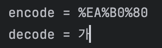

# TIL: URL 인코딩(%인코딩)과 디코딩
웹에서 데이터를 주고받을 때, URL은 특정 문자만을 안전하게 전달할 수 있도록 제한되어 있습니다. 그래서 한글이나 공백, 특수문자와 같은 문자는 인코딩을 통해 변환됩니다.

## URL 인코딩이란?

URL 인코딩은 URL 내에 포함될 수 없는 문자들을 허용된 형식으로 변환하는 과정입니다.
- **예시:** 한글 '가'는 브라우저나 서버가 이해할 수 있도록 `%인코딩` 방식을 사용하여 변환됩니다.
- 인코딩된 문자는 `%` 기호 뒤에 2자리의 16진수 코드로 표현됩니다.

URL 인코딩은 **문자열을 바이트(byte)** 단위로 변환한 후, 각 바이트를 16진수로 표현합니다.  
즉, 서버가 인코딩 방식을 "8비트" 또는 "16비트"라고 직접 알 수 있는 것이 아니라,  
양쪽(클라이언트와 서버) 모두 **미리 정해진 문자 인코딩 규약**(예: `UTF-8`)을 사용하여 인코딩과 디코딩을 수행합니다.


예를 들어, 자바에서 `URLEncoder.encode("가", UTF_8)`를 호출하면,
- 결과가 `%EA%B0%80`로 인코딩됩니다.

## URL 디코딩이란?

URL 디코딩은 인코딩된 문자열을 원래의 문자열로 변환하는 과정입니다.
- **예시:** `%EA%B0%80`를 다시 한글 '가'로 변환합니다.
- 이는 웹 애플리케이션에서 클라이언트가 보낸 인코딩된 데이터를 서버가 처리하기 위해 필요합니다.

## 예제 코드

아래는 자바로 작성된 URL 인코딩과 디코딩 예제입니다:

```java
public static void main(String[] args) {
    // URL 인코딩
    String encode = URLEncoder.encode("가", UTF_8);
    System.out.println("encode = " + encode);

    // URL 디코딩
    String decode = URLDecoder.decode(encode, UTF_8);
    System.out.println("decode = " + decode);
}
```


